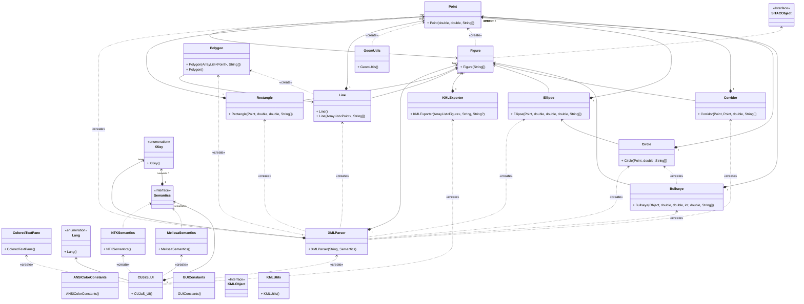

```mermaid
classDiagram
direction BT
class ANSIColorConstants {
  - ANSIColorConstants() 
}
class Bullseye {
  + Bullseye(Object, double, double, int, double, String[]) 
}
class CUJaS_UI {
  + CUJaS_UI() 
}
class Circle {
  + Circle(Point, double, String[]) 
}
class ColoredTextPane {
  + ColoredTextPane() 
}
class Corridor {
  + Corridor(Point, Point, double, String[]) 
}
class Ellipse {
  + Ellipse(Point, double, double, double, String[]) 
}
class Figure {
  + Figure(String[]) 
}
class GUIConstants {
  - GUIConstants() 
}
class GeomUtils {
  + GeomUtils() 
}
class KMLExporter {
  + KMLExporter(ArrayList~Figure~, String, String?) 
}
class KMLObject {
<<Interface>>

}
class KMLUtils {
  + KMLUtils() 
}
class Lang {
<<enumeration>>
  + Lang() 
}
class Line {
  + Line() 
  + Line(ArrayList~Point~, String[]) 
}
class MelissaSemantics {
  + MelissaSemantics() 
}
class NTKSemantics {
  + NTKSemantics() 
}
class Point {
  + Point(double, double, String[]) 
}
class Polygon {
  + Polygon(ArrayList~Point~, String[]) 
  + Polygon() 
}
class Rectangle {
  + Rectangle(Point, double, double, String[]) 
}
class SITACObject {
<<Interface>>

}
class Semantics {
<<Interface>>

}
class XKey {
<<enumeration>>
  + XKey() 
}
class XMLParser {
  + XMLParser(String, Semantics) 
}

Bullseye  ..>  Circle : «create»
Bullseye  -->  Figure 
Bullseye "1" *--> "center 1" Point 
CUJaS_UI  ..>  ColoredTextPane : «create»
CUJaS_UI  ..>  KMLExporter : «create»
CUJaS_UI  ..>  MelissaSemantics : «create»
CUJaS_UI  ..>  NTKSemantics : «create»
CUJaS_UI "1" *--> "semantics 1" Semantics 
CUJaS_UI  ..>  XMLParser : «create»
Circle  -->  Ellipse 
Circle "1" *--> "center 1" Point 
Corridor  -->  Figure 
Corridor "1" *--> "start_point 1" Point 
Ellipse  -->  Figure 
Ellipse "1" *--> "center 1" Point 
Figure  ..>  Point : «create»
Figure  ..>  SITACObject 
GeomUtils  ..>  Point : «create»
KMLExporter "1" *--> "figures *" Figure 
CUJaS_UI  -->  Lang 
Line  -->  Figure 
Line "1" *--> "points *" Point 
Line  ..>  Polygon : «create»
MelissaSemantics  ..>  Semantics 
NTKSemantics  ..>  Semantics 
Point  -->  Figure 
Polygon  -->  Line 
Rectangle  -->  Figure 
Rectangle "1" *--> "start 1" Point 
Semantics "1" *--> "keywords *" XKey 
XMLParser  ..>  Bullseye : «create»
XMLParser  ..>  Circle : «create»
XMLParser  ..>  Corridor : «create»
XMLParser  ..>  Ellipse : «create»
XMLParser "1" *--> "figures *" Figure 
XMLParser  ..>  Line : «create»
XMLParser  ..>  Point : «create»
XMLParser  ..>  Polygon : «create»
XMLParser  ..>  Rectangle : «create»
XMLParser "1" *--> "keywords *" XKey
```