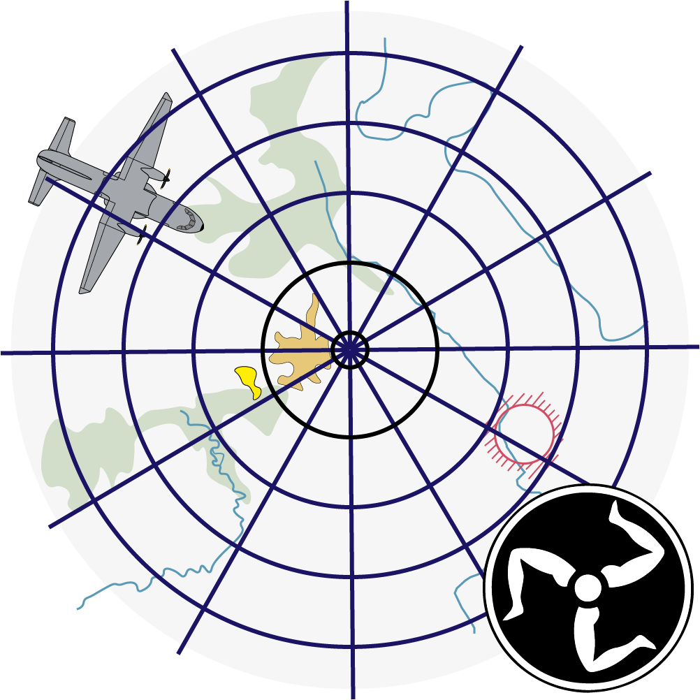
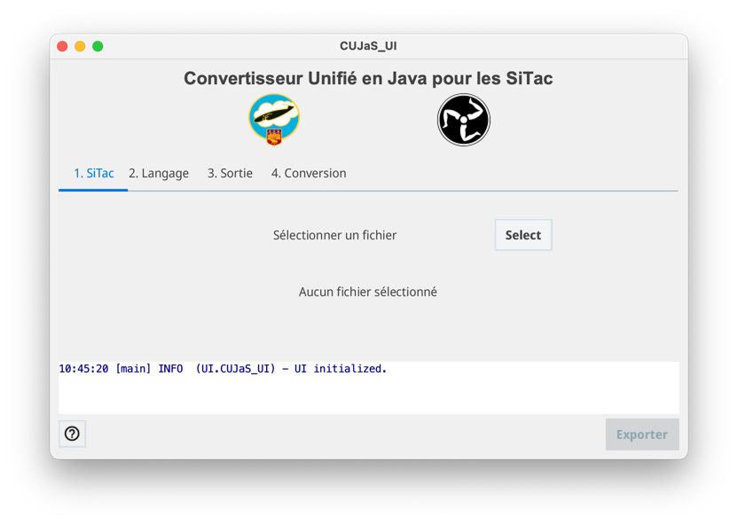
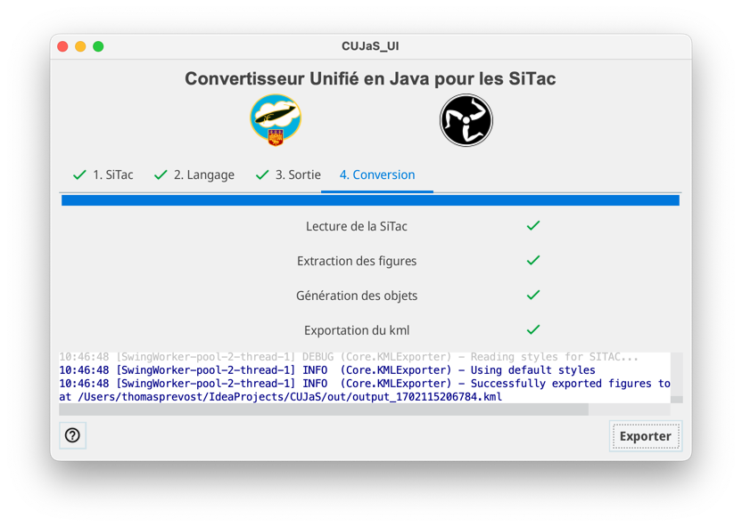
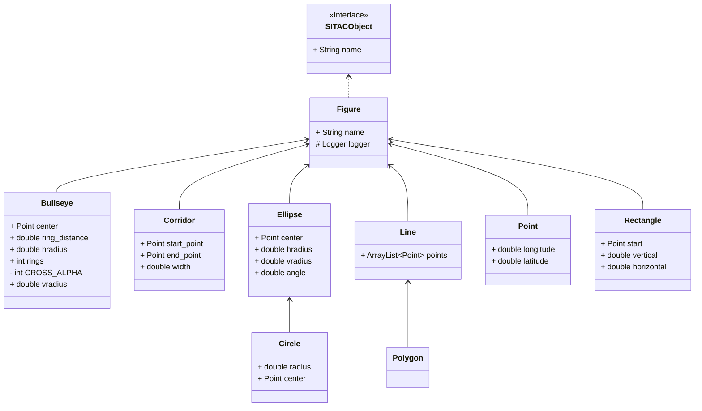

# Convertisseur Unifié en JAVA pour les SiTaC (CUJaS)

<p align="center">

</p>

## Objectifs
Ce programme, développé en Java afin d'en faire un exécutable unique fonctionnel hors-ligne, vise à unifier et améliorer les convertisseurs de SiTac au format `kml` pour les vols d'entraînement.
Il doit à ce titre, être :
- simple d'utilisation ;
- robuste ;
- exécutable de lui-même, hors-ligne, sur un poste Windows ;
- simple à étendre, améliorer, et debugger.

|  |  |
|------------------------------------------------------------|------------------------------------------------------------|


## Implémentation
À ces fins, le convertisseur unifié repose sur une architecture en "couches", permettant de séparer le langage de SiTac de l'implémentation des objets, offrant une très large souplesse dans le changement éventuel de syntaxe pour le fichier en entrée sans incidence sur la qualité du fichier `kml` en sortie.

```mermaid
stateDiagram-v2
    direction LR
    nodes: Nodes XML
    objects: Figures
    kmlobj: Fragments kml
    kml: Code kml
    file: Fichier kml
    style: Styles kml
    [*] --> nodes : Fichier SiTac
    Semantics --> XMLParser : syntaxe
    state XMLParser {
        nodes --> objects
        objects --> kmlobj
    }
    state KMLBuilder {
        kmlobj --> kml
        
    }
    style --> kml
    kml --> file
    file --> [*]
    
    note right of XMLParser
        Monde du langage (syntaxe-dépendant)
    end note
    note left of KMLBuilder
        Monde des objets (implémentation-dépendant)
    end note
```


## Utilisation
Simplement lancer l'outil, et se laisser guider dans l'interface. Pour info, il faut :
1. Sélectionner un fichier d'entrée
2. Sélectionner le langage du fichier d'entrée
3. Sélectionner le dossier de sortie pour le fichier `kml`
4. Éventuellement, choisir un fichier de styles `kml` personnalisés (si on souhaite d'autres styles pour les objets que ceux par défaut)
5. Lancer la conversion.

Toute erreur de traitement / conversion sera notifiée dans la console de l'outil (généralement, c'est une erreur de fichier d'entrée, ou de sélection du langage).
Les objets reconnus dans la SiTac mais non encore implémentés sont également consignés dans la console pour information.

## Objets supportés
